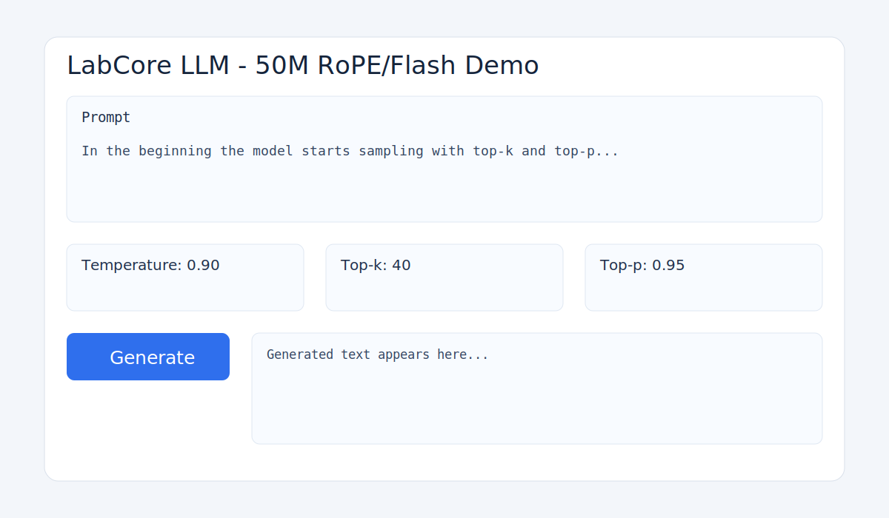

# LabCore LLM Docs

Welcome to the public docs for LabCore LLM.

## Links

- Gradio demo script: [demo_gradio.py](../demo_gradio.py)
- Hugging Face model target: [GhostPunishR/labcore-llm-50M](https://huggingface.co/GhostPunishR/labcore-llm-50M)
- GGUF outputs folder: [`outputs/gguf/`](../outputs/gguf/)

## Gradio Screenshot

